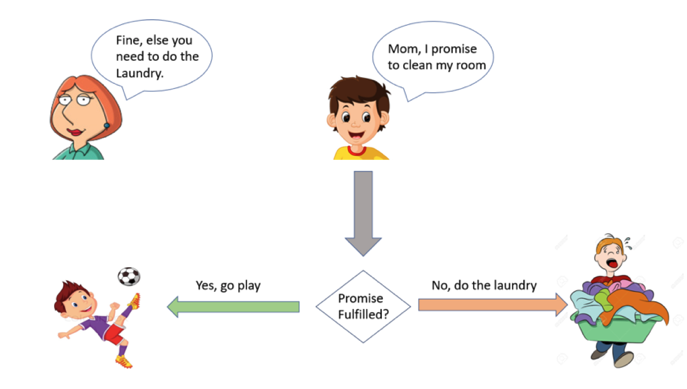

# Exercise about Events & Promises
1. Please create a small calculator using HTML and JS DOM and add functionalities (+, -, *, /)
2. Write the definition (producer code) and consumer code of a promise for the following senario.
    - John is son of Susan. Susan promised her son to let him play football after he clean his room. But if John doesn't clean it, he is not allowed to play football and has to do the laundry.
  
